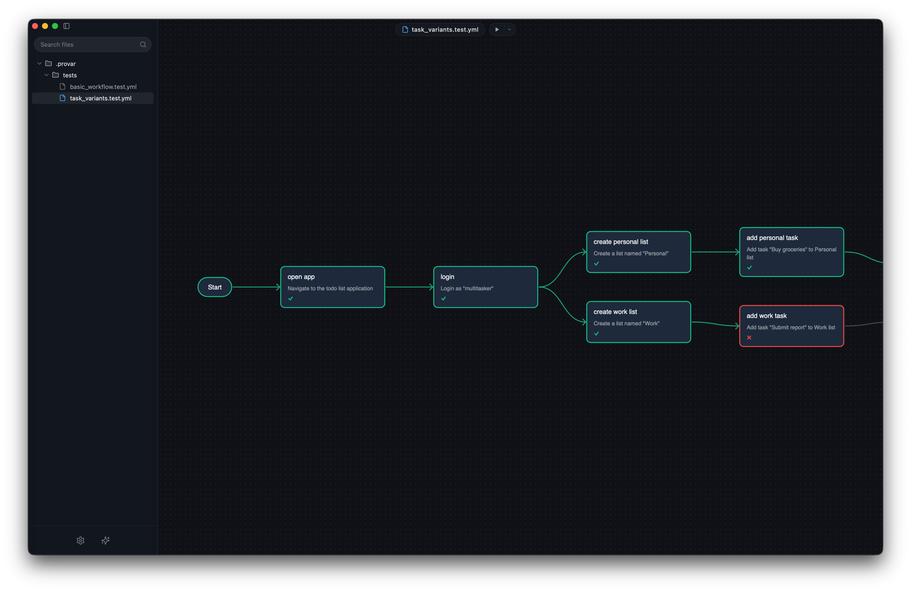

# Provar

Provar is a Git-native end-to-end testing tool that combines visual flow mapping with AI assistance, allowing you to design and execute tests completely on your local machine.

## Key Features

### Flow-Based Logic

User journeys are rarely linear. Provar uses an intuitive, graph-based canvas that mirrors how users actually interact with your application. Instead of writing lines of code to navigate pages, you map out journeys as visual flowcharts, making it straightforward to see, manage, and design branching behaviors.

### AI-Assisted Design

Define your test cases at a high level and let the agent figure out the implementation details. By analyzing the page state in real time, the agent automatically handles element selection, assertion writing, and dynamic application states. This also makes your tests self-healing, as minor UI changes can be easily adapted to by regenerating the underlying code.

### Local Sovereignty & Git-Native

Unlike cloud-based testing platforms that require uploading sensitive data, Provar works entirely within your local development environment. All test flows, configurations, and generated code live right in your Git repository. This ensures maximum security, fits perfectly into your existing developer workflows, and runs seamlessly in your CI/CD pipelines without external dependencies.

### Designed for Developers

Provar is designed to integrate into your daily workflow. With a developer-first approach, a robust local editor, and an open-source foundation, it provides the visual clarity of a low-code tool without sacrificing the power, flexibility, and control of code-based testing.
