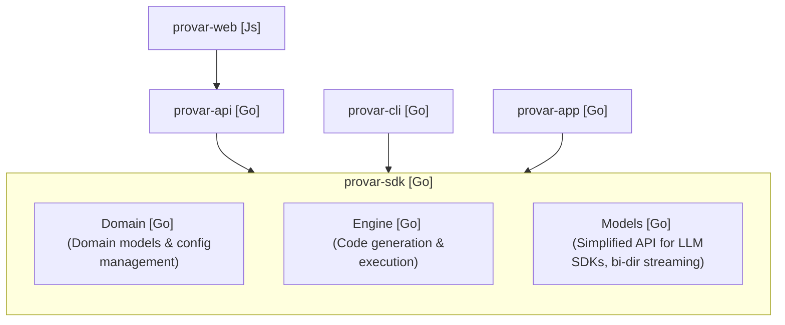

# Provar — System Architecture (Living)

This document is the living system design and technical specification for Provar. It outlines the monorepo architecture, application dependencies, and internal SDK library boundaries.

## 1. Monorepo Architecture

Provar is structured as a monorepo containing multiple applications (`apps/`) and reusable libraries (`libs/`).

### Applications (`apps/`)

- `provar-app`: The graphical editor desktop application for authoring and debugging tests visually.
- `provar-cli`: The command-line interface for compiling and running test suites headlessly in terminal and CI environments.
- `provar-api`: The backend API server providing services and database interactions for the web application.
- `provar-web`: The user-facing website and product guide.

### Libraries (`libs/`)

- `sdk`: The core SDK combining domain schemas, the compiler and execution engine, and LLM model wrappers.

## 2. Technical Dependencies

The following diagram illustrates the relationship and dependencies between Provar applications and libraries:

## 3. Internal SDK Boundaries

The `libs/sdk` directory houses three logical packages, isolating concerns and maintaining a clear boundary:

1. **Domain**: Contains baseline entities, schemas, and configurations that are shared across all tools.
2. **Engine**: Houses code generation, runner execution loops, and compiler logic to translate visual test graphs into runnable test actions.
3. **Models**: Interacts with OpenAI and Anthropic SDKs, presenting a unified interface supporting bidirectional streaming responses.
