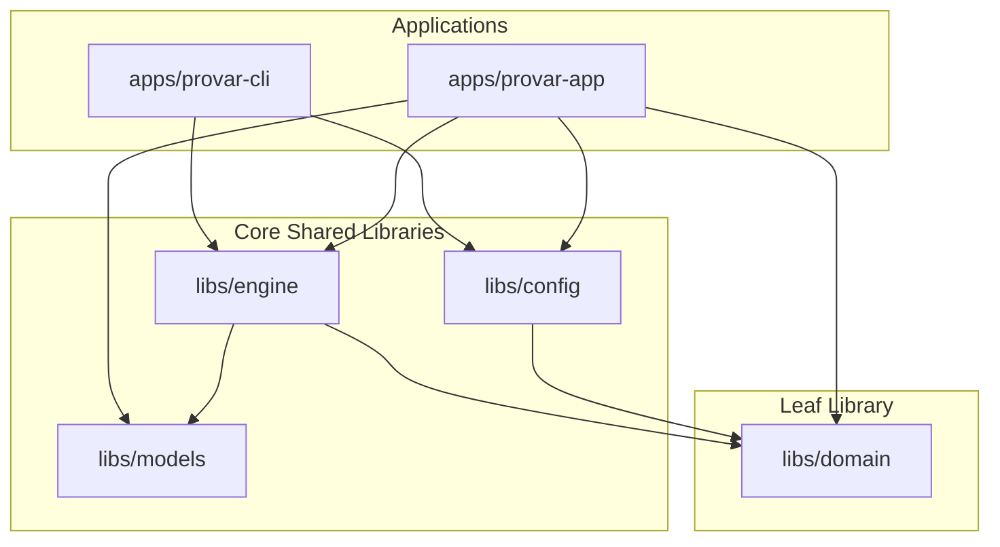

# 014 - Architectural Boundaries and Responsibilities

## Context

As the Provar project grows, developers and automated agents need clear, unambiguous rules to determine where new code belongs and where it does not. While ADR #011 established the initial modular shared libraries architecture, we need to define strict boundaries, responsibilities, and dependency rules for all shared libraries (`@libs/*`) and applications (`apps/*`). This is focused on separation of concerns rather than implementation details.

---

## Decision

We establish the following architectural boundaries, responsibilities, and constraint rules for the Provar codebase. All developers and agents must adhere to these rules when creating or modifying code.

### Dependency Hierarchy

To prevent circular dependencies and maintain modularity, the package dependency flow must be strictly unidirectional from higher-level consumers (applications) to lower-level utility libraries:

---

## 1. Shared Libraries (`libs/*`)

### `@libs/domain`
The foundational layer of the codebase defining data models and validation.
* **Responsibilities:**
  - Establish the single source of truth for both raw serialized disk files (e.g. `.test.yml`) and loaded runtime objects (e.g. `Project`, `Graph`, `Task`, `Path`).
  - Provide runtime data validation schemas using Zod (e.g. `schemaForGraph`, `schemaForLoadedTask`).
  - Export core TypeScript types inferred from schemas.
* **Constraints:**
  - **MUST NOT** import from any other internal `@libs/*` package.
  - **MUST NOT** perform filesystem I/O (`fs`, `path`), network, browser automation, or LLM operations.
  - **MUST NOT** contain application logic or UI state.

### `@libs/config`
Global application configuration store on the user's system.
* **Responsibilities:**
  - Define the Zod schema and TypeScript types for global user settings (e.g., LLM provider API keys, recent workspaces list).
  - Handle loading and saving user settings to the persistent global path (`~/.provar/settings.json`).
* **Constraints:**
  - **MUST NOT** manage individual project workspace settings or variables (which belongs to `@libs/domain` / `@libs/engine`).
  - **MUST NOT** import from other `@libs/*` packages except `@libs/domain` (if global schemas require domain references).
  - **MUST NOT** initiate LLM connections or sessions directly (delegated to `@libs/models`).

### `@libs/models`
AI Model orchestration and LLM communication client wrappers.
* **Responsibilities:**
  - Initialize and manage LLM API connections via the Vercel AI SDK.
  - Manage session state and conversation history.
  - Provide helper functions to dynamically convert standard `Command` structures into AI-runnable tools (`convertCommandsToTools`).
* **Constraints:**
  - **MUST NOT** import or depend on `@libs/config`. It must receive generic config parameters (`AgentClientConfig`) passed in by callers.
  - **MUST NOT** perform filesystem operations directly. It must interact with the host system strictly via tools supplied to it.
  - **MUST NOT** import or depend on `@libs/engine`.

### `@libs/engine`
Unified loading, compilation, and browser execution engine.
* **Responsibilities:**
  - Crawl directory structures to find `.provar/` configs and `.test.yml` file lists.
  - Parse declarative YAML test files and resolve their linear execution paths.
  - Bind dynamically imported compiled `.test.ts` functions to the loaded graph representation.
  - Spawn and manage browser sessions (chromium, headed/headless) via Playwright.
  - Run compiled TypeScript task functions step-by-step using Playwright.
  - Expose real-time runner controls (pause, resume, cancel) and state tracking.
  - Capture step-level screenshots and emit events for UI progression tracking.
  - Orchestrate the compilation pipeline of `.test.yml` into `.test.ts` files.
  - Launch AI model sessions using `@libs/models` to ground and generate task interaction code in a stateful grounding sandbox.
  - Serialise compiled tasks into linear execution-path files and write them to disk with validation hash headers.
  - Generate performance telemetry reports (`.trace.json`).
* **Constraints:**
  - **MUST NOT** import or depend on `@libs/config`. It must receive required LLM client/configurations from the application layer.
  - **MUST NOT** contain any desktop UI/Svelte views or Electron-specific code.
  - **MUST NOT** save, delete, or modify workspace files (except for temporary runtime outputs like screenshots, and generating compiled `.test.ts` / `.trace.json` files).
  - **MUST NOT** modify workspace files or folders outside of the compilation/execution context (delegated to the application's commands module).

---

## 2. Applications (`apps/*`)

### `apps/provar-app`
The main desktop user interface.
* **Responsibilities:**
  - Render the visual workspace editor, settings panels, and runner execution graphs (Svelte).
  - Implement the desktop environment (Electrobun), menus, dialogs, and main process IPC bindings.
  - Connect user interactions (run buttons, editor saves, settings updates) to the underlying `@libs/*` APIs.
  - Implement a uniform Command Pattern (`Command`, `CommandContext`) under `src/bun/commands/` for workspace manipulation, filesystem mutations, and configuration updates with directory traversal protection.
  - Stream running execution events back to the UI.
* **Constraints:**
  - **MUST NOT** implement loading, compilation, or execution logic directly (delegated to `@libs/engine`).

### `apps/provar-cli`
Command-line runner tool.
* **Responsibilities:**
  - Parse arguments and flags for headless execution and compilation.
  - Expose `provar compile` and `provar run` terminal interface commands.
  - Format and render progress logs, error traces, and performance reports to stdout.
* **Constraints:**
  - **MUST NOT** contain any GUI, Electrobun, or Electron dependencies.
  - **MUST NOT** implement loading, compilation, or execution logic internally; it must strictly delegate to `@libs/engine`.

---

## Consequences

- **Clear Boundaries:** Developers and agents can quickly determine where to write new logic based on whether it concerns domain schemas, filesystem actions, execution, compilation, or LLMs.
- **Modularity:** Prevents circular dependency loops and ensures that libraries can be easily tested and reused in CLI or automated server pipelines without UI overhead.
- **Secure filesystem mutations:** All changes to workspaces must pass through the app's encapsulated commands module, ensuring strict bounds-checking and preventing arbitrary filesystem writes.
